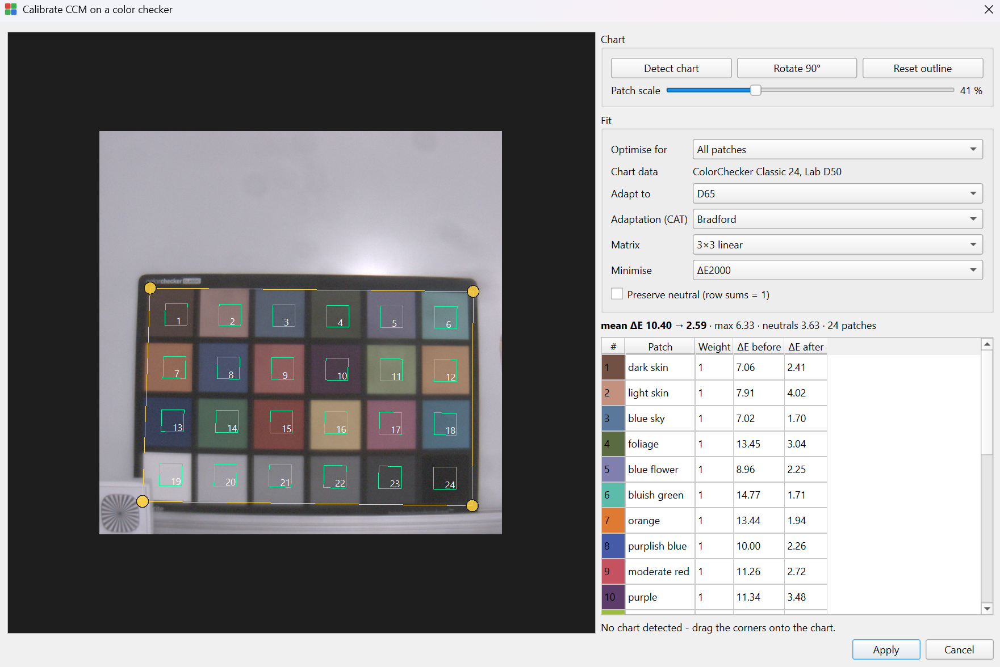
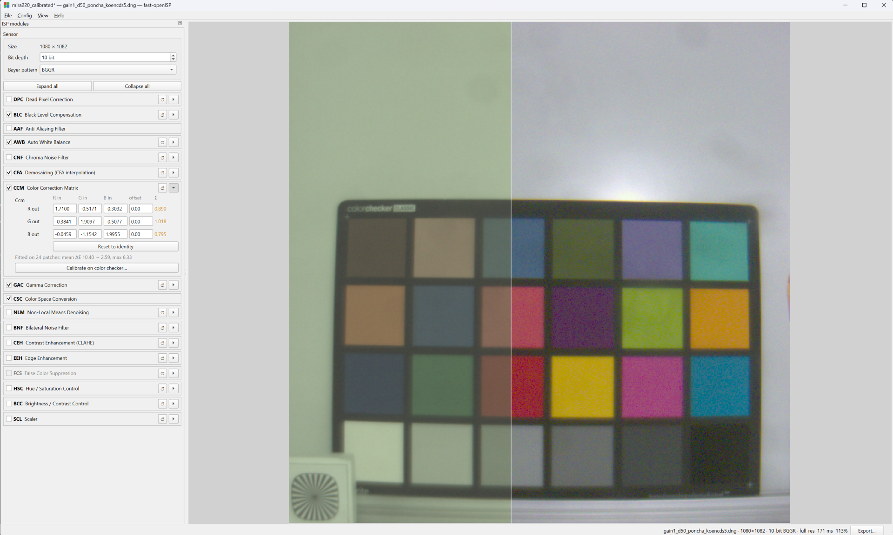

# Color calibration

The color correction matrix (CCM) is the one block that cannot be guessed: it depends on the
spectral response of the sensor and its color filters. The GUI can measure it for you from a
photograph of an **X-Rite / Calibrite ColorChecker Classic** (24 patches).

Open **CCM → Calibrate on color checker…** (or **Config → Calibrate CCM on color checker…**).



## Before you start

1. **Photograph the chart** filling a good part of the frame, evenly lit, with no specular
   reflections on the patches and no clipping. Slight underexposure is better than a blown
   white patch; clipped patches are detected and excluded, but they no longer help the fit.
2. **Set the white balance first.** The matrix is fitted on white-balanced data, so the fit only
   has to deal with color crosstalk. Use AWB in *grey world* mode and then **Freeze as manual**,
   or enter measured gains. If AWB is off, the matrix absorbs the white balance and its rows no
   longer sum to 1.
3. **Enable CFA.** Calibration needs a demosaiced image.

Calibration always runs on the **full-resolution** image, not on the preview, so patch means are
as accurate as possible.

## Locating the chart

The dialog tries OpenCV's chart detector as soon as it opens. Whatever it finds (or a default
rectangle if it finds nothing) is drawn as an outline with four yellow corner handles and a
6 × 4 grid of sampling squares, numbered in reading order.

| Control | What it does |
|---|---|
| Drag a corner handle | Moves that chart corner; the grid and the fit follow immediately |
| **Detect chart** | Runs the automatic detector again |
| **Rotate 90°** | Rotates the patch order, for a chart that is not in landscape orientation |
| **Reset outline** | Puts the default rectangle back in the middle of the image |
| Mouse wheel / drag | Zoom and pan the image |

Patch **1** must be *dark skin* (the brown patch) and patch **19** the white one. If the numbers
in the overlay do not match the chart, use **Rotate 90°**.

**Patch scale** sets how much of each cell is averaged, from 20 % to 90 % of the cell. Smaller
is safer when the outline is slightly off or the chart is photographed at an angle; larger
averages more pixels and so suppresses noise. 60 % is a good default.

## What the fit optimises

**Optimise for** picks a set of per-patch weights:

| Preset | Weights |
|---|---|
| All patches | every patch equally |
| Neutrals (grey ramp) | the six greys ×4, the colours ×0.25 — best greyscale accuracy |
| Neutrals only | the six greys; the colours are ignored completely |
| Skin tones | dark skin, light skin, orange and orange yellow ×4, greys ×1, rest ×0.25 |

Any weight can be edited in the **Weight** column of the table; the preset then switches to
*Custom*. A weight of 0 removes the patch from the fit while still reporting its error.

Other controls:

- **Matrix**: *3 × 3 linear* fits gains only; *3 × 4 with offsets* also fits a per-channel
  offset. Offsets can hide a black-level error, so prefer the 3 × 3 fit unless the greys are
  visibly off and BLC cannot be corrected.
- **Minimise**: the metric OpenCV minimises, ΔE2000 (perceptual, recommended) or ΔE76.
- **Preserve neutral (row sums = 1)**: scales each row so its three gains sum to 1.0, which
  guarantees that a neutral input stays neutral, at the cost of a slightly larger error.

## Illuminant adaptation (CAT)

The chart's reference values are published as CIE L\*a\*b\* under **D50**, while sRGB — what the
rest of the pipeline assumes — is defined for **D65**. The reference colors are therefore
chromatically adapted before the fit:

- **Adapt to** is the white point the corrected image should be rendered for. Leave it at
  **D65** for normal sRGB output. Choosing `A`, `TL84`, `D50`, `D55` or `E` fits a matrix that
  renders the scene as it would look under that illuminant, so neutral patches deliberately
  stop being neutral.
- **Adaptation (CAT)** is the transform used: **Bradford** (the usual choice), **CAT02**,
  **von Kries**, or **None** to use the D50 values unchanged.

## Reading the result

The summary line shows

```
mean ΔE 8.42 → 2.11 · max 4.90 · neutrals 1.34 · 24 patches
```

- **mean ΔE** — average CIEDE2000 error over the patches in the fit, *before* (with the matrix
  currently in the configuration) and *after*.
- **max** — the worst patch, which is usually a saturated primary.
- **neutrals** — mean error over the grey ramp, the number to watch for a neutral-looking image.

The table lists every patch with its reference swatch, weight and error before and after. An
error that got *worse* is shown in red; patches excluded because they are clipped are greyed out
and marked.

As a rough guide, a mean ΔE below 3 is good for a camera pipeline and below 2 is very good.
A large residual usually means the chart outline is off, the illumination is uneven, the white
balance is wrong, or the chart is lit by a light source with a spiky spectrum.

**Apply** writes the matrix into the CCM parameters, exactly as if you had typed it into the
grid: the preview updates, the title bar shows unsaved changes, and **Config → Save YAML** keeps
it. The CCM box then shows a reminder of the fit, for example
*Fitted on 24 patches: mean ΔE 10.40 → 2.59, max 6.33*.

The split view (++f4++) shows the result against the untouched input: on the left the raw frame
with no ISP at all, on the right the full pipeline with the fitted matrix. The CCM is what
brings the saturated patches to their reference colours; the greys are the work of BLC and AWB
before it:



## Limits

- Only the 24-patch ColorChecker Classic layout is supported (no Digital SG or Passport
  extensions).
- The matrix is a linear transform: it cannot fix a non-linear tone response, lens shading or
  an incorrect black level.
- Fitting for one illuminant does not guarantee accuracy under another. Shoot the chart under
  the light you care about, or calibrate once per illuminant and keep several YAML files.
